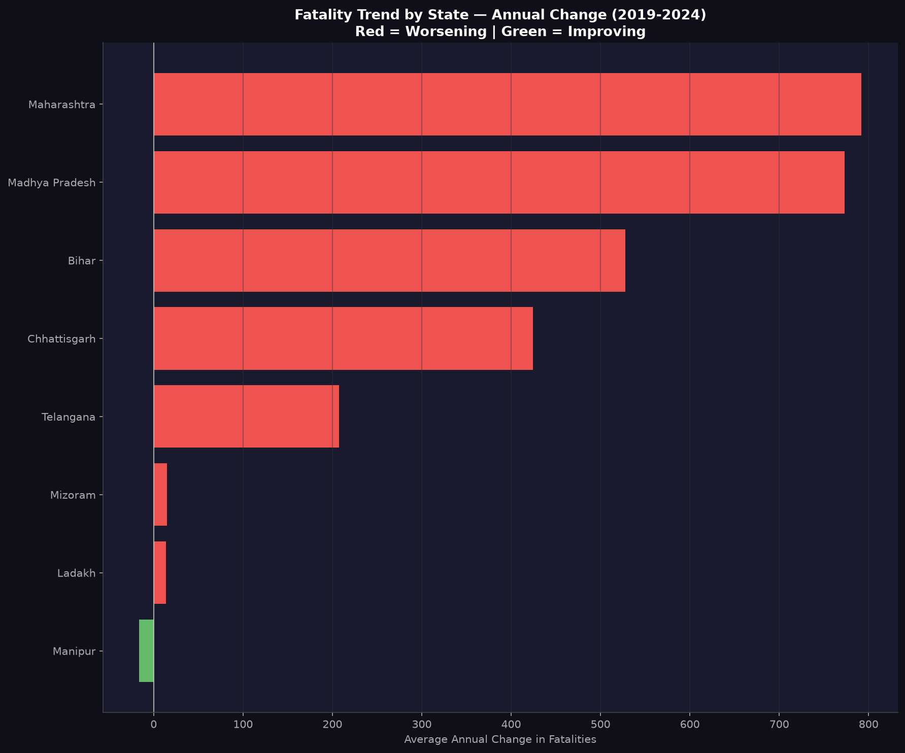

# 🚨 India Road Accident Pattern Intelligence
### Highway Risk Analytics for Insurance & Logistics | MoRTH 2019–2024


> End-to-end road accident analytics platform built on 6 years of official Ministry of Road Transport & Highways (MoRTH) data. Covers geospatial risk mapping, fatality forecasting, statistical correlation analysis, and an interactive Power BI intelligence dashboard — targeting insurance, logistics, and public safety sectors.

---

## 📌 Why This Project Stands Out

Most road safety analyses use Kaggle datasets or single-year snapshots. This project:

- Uses **official MoRTH government data** (2019–2024) — not publicly pre-structured on Kaggle
- Normalizes accident counts **per vehicle and per accident** to expose true risk — raw count rankings mislead
- Adds the **most recent 2024 data** the month it was publicly released (June 2026)
- Combines **geospatial mapping, forecasting, regression, and BI dashboard** in one pipeline
- Identifies **Bihar's fatality rate (0.81) is 10x higher than Kerala's (0.08)** despite Kerala having 4x more accidents — a finding invisible in headline statistics

---

## 📊 Key Findings

### National Scale
| Metric | Value |
|---|---|
| Total accidents (2024) | 4,87,707 |
| Total fatalities (2024) | 1,77,175 |
| Total injuries (2024) | 4,71,441 |
| YoY accident change | +1.5% |
| YoY fatality change | +2.5% |
| National fatality rate | 0.3633 deaths per accident |
| Post-COVID surge (2020→2024) | +31% in accidents |

### State Risk — Normalized (Fatality Rate per Accident, 2024)
| Rank | State | Fatality Rate | Accidents | Fatalities |
|---|---|---|---|---|
| 🔴 1 | Bihar | 0.8051 | 11,610 | 9,347 |
| 🔴 2 | Jharkhand | 0.7918 | 5,196 | 4,114 |
| 🔴 3 | Punjab | 0.7849 | 6,063 | 4,759 |
| 🔴 4 | Uttarakhand | 0.6239 | 1,747 | 1,090 |
| 🔴 5 | Uttar Pradesh | 0.5237 | 46,052 | 24,118 |
| 🟢 36 | Kerala | 0.0795 | 48,834 | 3,880 |

> **Bihar's fatality rate (0.81) is 10.1x higher than Kerala's (0.08) despite Kerala recording 4x more total accidents.** This gap reflects infrastructure quality and trauma care access, not accident volume.

### States Improving vs Worsening (2024 YoY)
| State | YoY Fatality Change | Trend |
|---|---|---|
| Haryana | -5.62% | ✅ Improving |
| Kerala | -4.90% | ✅ Improving |
| Punjab | -1.45% | ✅ Improving |
| Chhattisgarh | +12.63% | ❌ Worsening |
| West Bengal | +10.77% | ❌ Worsening |
| Puducherry | +46.31% | ❌ Worsening |

### Time of Day Risk (2024)
| Time Slot | Accidents | Share |
|---|---|---|
| 🔴 18:00–21:00 (Peak) | 1,02,897 | 21.1% |
| 🟠 15:00–18:00 | 85,010 | 17.4% |
| 🟡 12:00–15:00 | 71,386 | 14.6% |
| 🟢 03:00–06:00 (Safest) | 23,398 | 4.8% |

> **18:00–21:00 is the single deadliest window** — peak commute volume combined with low-light conditions. The safest window (03:00–06:00) sees only 4.8% of accidents despite high-speed driving.

### Cause of Fatalities (2023)
| Violation | Fatalities | Share |
|---|---|---|
| Over-speeding | 1,17,682 | 68.07% |
| Others | 38,400 | 22.21% |
| Wrong side / Lane indiscipline | 9,432 | 5.46% |
| Drunk driving | 3,674 | 2.13% |
| Mobile phone use | 2,884 | 1.67% |
| Jumping red light | 818 | 0.47% |

> **Over-speeding alone accounts for 68% of all road fatalities** — dwarfing drunk driving (2.1%) and mobile phone use (1.7%). Speed enforcement is the primary intervention lever, not awareness campaigns.

### Statistical Findings
- Accidents vs Fatalities: **r = 0.816, p < 0.0001** — strong significant positive correlation
- OLS Regression: each additional state accident → **+0.2652 fatalities** on average (R² = 0.666)
- YoY accident growth vs fatality growth: **r = 0.533, p = 0.006** — significant
- Log(accidents) vs fatality rate: **r = -0.086, p = 0.68** — not significant (busier roads are NOT more dangerous per crash)

### Forecast (Prophet Model, 80% Confidence Interval)
| Year | Accidents Forecast | Fatalities Forecast |
|---|---|---|
| 2025 | 5,13,042 [4,69,290–5,55,542] | 1,88,512 [1,78,166–1,98,447] |
| 2026 | 5,28,118 [4,86,715–5,67,928] | 1,94,481 [1,84,033–2,04,429] |
| 2027 | ~5,43,000 | ~2,00,000 |

> At current trajectory, India is projected to cross **2 lakh road fatalities by 2026–2027** — a 22.3% increase from 2019 baseline.

### Additional Statistics
- **54,568 people killed without helmets** in 2023
- **Two-wheelers account for 46.2%** of all fatalities (2024)
- **Pedestrians account for 20.6%** of all fatalities (2024)
- **Rural roads account for 70.8%** of fatalities despite 62.4% of accidents — rural fatality rate is significantly higher
- Tamil Nadu is **#1 in raw accidents (67,526)** but ranks #23 in fatality rate — demonstrating why normalization matters

---

## 🗺️ Interactive Maps

> Both maps are fully interactive — hover over any state to see fatality rate, total accidents, and total fatalities. State names and metrics are visible directly on the map without hovering.

### Map 1 — India Risk Map (Fatality Rate per Accident)
**[🔴 Open Live Interactive Map →](https://IamShariqMukadam.github.io/road-accident-maps/india_risk_map.html)**

Color scale: 🟢 Green = low fatality rate → 🔴 Red = high fatality rate per accident

*Red markers indicate Top 10 highest-risk states. This map uses normalized risk — not raw accident counts — which is why Bihar (0.81) appears darkest red despite Tamil Nadu having 4x more total accidents.*

---

### Map 2 — India Accidents Map (Raw Count)
**[🟠 Open Live Interactive Map →](https://IamShariqMukadam.github.io/road-accident-maps/india_accidents_map.html)**

Color scale: Yellow → Red by total accident volume

*Compare Map 1 vs Map 2 side by side — the different state color rankings between the two maps visually demonstrate why raw accident counts are a misleading safety metric.*

---

## 📉 Forecast — India Road Accident Trajectory 2025–2027


Prophet time-series model trained on 2019–2024 national data. Both accident and fatality series are forecast separately with 80% confidence intervals. Annotated values on every data point — actual (2019–2024) and forecast (2025–2027). COVID-19 structural break (2020 dip) is clearly visible and correctly handled by Prophet's changepoint detection.

**Key forecast numbers:**
- 2025 fatalities: **1,88,512** [range: 1,78,166 – 1,98,447]
- 2026 fatalities: **1,94,481** [range: 1,84,033 – 2,04,429]
- 2027 projected fatalities: **~2,00,000** — crossing 2 lakh for the first time

---

## 🔥 Correlation Heatmap


Pearson correlation matrix across 8 engineered features at state level (2024). Lower triangle only — upper triangle masked to avoid redundancy. Key values:

- **Accidents ↔ Fatalities: r = 0.82** — strong, significant
- **Log Accidents ↔ Log Fatalities: r = 0.90** — strongest pair (log-space relationship is near-linear)
- **Log Accidents ↔ Fatality Rate: r = -0.09** — not significant (busier roads are NOT more dangerous per crash — counterintuitive but statistically confirmed)
- **YoY Accident % ↔ YoY Fatality %: r = 0.53** — moderate, significant (accident growth drives fatality growth year-over-year)

---

## 📐 Regression Analysis — Statistical Relationships


Three scatter plots with OLS regression lines, full stats boxes (r, R², p-value, equation), and all 36 states labeled:

- **Left:** Accidents vs Fatalities — r=0.816, R²=0.666, p<0.05 ✓ — each additional accident adds 0.2652 fatalities on average
- **Centre:** Log(Accidents) vs Fatality Rate — r=-0.086, R²=0.007, p≥0.05 ✗ — no significant relationship (volume alone doesn't determine danger per crash)
- **Right:** YoY Accident % vs YoY Fatality % (2023→2024) — r=0.533, R²=0.284, p<0.05 ✓ — states with rising accidents show rising fatalities; quadrant zones show which states are improving/worsening simultaneously

---

## 📊 State Fatality Trends (2019–2024)



OLS linear regression slope per state over 2019–2024 — ranks every state by average annual fatality change. Red bars = worsening (positive slope), green bars = improving (negative slope). Maharashtra and Madhya Pradesh show the steepest annual fatality increases (~780/year). Manipur is the only state with a statistically significant improving trend.

---

## 🏗️ Project Architecture

```
road-accident-intelligence/
├── data/
│   ├── raw/                          # 15 source CSVs (MoRTH via OpenCity + PDF extract)
│   └── cleaned/                      # Processed tables ready for PostgreSQL
├── notebooks/
│   ├── 01_clean_merge.ipynb          # Data pipeline: clean, merge, feature engineering
│   ├── 02_geospatial_map.ipynb       # Folium choropleth maps (2 interactive HTML maps)
│   ├── 03_forecasting.ipynb          # Prophet forecasting + state trend analysis
│   └── 04_correlation_regression.ipynb # Pearson/Spearman correlation + OLS regression
├── sql/
│   ├── 01_state_risk_ranking.sql     # Normalized state risk (fatality rate, not raw count)
│   ├── 02_yoy_fatality_trend.sql     # YoY change with window functions
│   ├── 03_national_trend.sql         # National 2019–2024 summary
│   ├── 04_time_of_day_peak.sql       # Hourly risk analysis
│   └── 05_violation_fatality_share.sql # Cause of fatality breakdown
├── outputs/
│   ├── india_risk_map.html           # Interactive India choropleth (fatality rate)
│   ├── india_accidents_map.html      # Interactive India choropleth (raw accidents)
│   ├── forecast_chart.png            # Prophet forecast with annotated values
│   ├── correlation_heatmap.png       # Pearson correlation matrix
│   ├── regression_scatter.png        # OLS scatter plots (3 panels)
│   └── state_fatality_trends.png     # State-level annual trend chart
└── README.md
```

---

## 🛠️ Tech Stack

| Layer | Technology | Purpose |
|---|---|---|
| Data extraction | Python, pandas | Clean 15 CSVs, handle MoRTH multi-year format |
| Feature engineering | numpy, pandas | Fatality rate, YoY change, normalized metrics |
| Database | PostgreSQL 16 | 10 relational tables, window functions, CTEs |
| Geospatial | Folium, GeoPandas, Requests | Interactive India choropleth with state labels |
| Forecasting | Facebook Prophet | National accident/fatality forecast 2025–2027 |
| Statistics | scipy, statsmodels | Pearson/Spearman correlation, OLS regression |
| Visualization | matplotlib, seaborn | EDA charts, correlation heatmap, regression plots |
| BI Dashboard | Power BI Web | Intelligence center — KPIs, trend, risk ranking |
| Data source | MoRTH (morth.gov.in) | Official government data — not Kaggle |

---

## 📂 Data Sources

| File | Source | Coverage |
|---|---|---|
| `state_accidents_2019_2023.csv` | OpenCity (data.opencity.in) — MoRTH structured | 36 states, 2019–2023 |
| `state_fatalities_2019_2023.csv` | OpenCity — MoRTH structured | 36 states, 2019–2023 |
| `state_accidents_2024.csv` | **Manually extracted from MoRTH 2024 PDF** (Table 5.1) | 36 states, 2024 |
| `state_fatalities_2024.csv` | **Manually extracted from MoRTH 2024 PDF** (Table 5.6) | 36 states, 2024 |
| `time_of_day_2020_2024.csv` | **Manually extracted from MoRTH 2024 PDF** (Table 7.3) | 8 time slabs, 2020–2024 |
| `violation_type_2023.csv` | OpenCity — MoRTH structured | 6 violation categories |
| `collision_type_2023.csv` | OpenCity — MoRTH structured | 10 collision types |
| `road_user_fatalities_2023.csv` | OpenCity — MoRTH structured | 10 road user categories |
| `safety_devices_2023.csv` | OpenCity — MoRTH structured | Helmet/seatbelt data |
| `large_cities_accidents_2023.csv` | OpenCity — MoRTH structured | 51 million-plus cities |
| `vehicle_road_density_2023.csv` | OpenCity — MoRTH structured | National vehicle/road trend |

**Primary source:** Ministry of Road Transport & Highways — *"Road Accidents in India"* annual reports, 2019–2024. Available at [morth.gov.in](https://morth.gov.in).

**Data note:** 2024 report data (state-wise accidents, fatalities, time-of-day) was incorporated the same month it was publicly released (June 2026) — making this the most current public analysis available.

---

## 🗄️ Database Schema (PostgreSQL 16)

```sql
-- Core table: 216 rows (36 states × 6 years)
state_master (state, year, accidents, fatalities,
              fatality_rate_per_accident,
              yoy_accident_change, yoy_fatality_change)

-- Lookup tables (2023 data)
violation_type      -- 6 causes × accident/fatality/injury columns
collision_type      -- 10 collision types
road_user_fatalities -- 10 road user categories
safety_devices      -- helmet/seatbelt fatality data
large_cities        -- 51 cities × accident/fatality metrics
large_cities_road_user
large_cities_violation
victims_vehicles    -- victim-vehicle matrix
vehicle_road_density -- national vehicle/road growth trend

-- Time series
time_of_day         -- 8 slabs × 5 years (2020–2024)
```

**Key SQL techniques used:** Window functions (`LAG`, `RANK`, `OVER PARTITION BY`), CTEs, percentage calculations, aggregate filtering.

---

## 📈 Analysis Modules

### Module 1 — Data Pipeline (`01_clean_merge.ipynb`)
- Ingests 15 CSVs across 2 different MoRTH formats (OpenCity structured + manual PDF extract)
- Standardizes inconsistent state names across years (pre-2020 UTs merged post-reorganization)
- Engineers: `fatality_rate_per_accident`, `yoy_accident_change`, `yoy_fatality_change`
- Loads 10 clean tables to PostgreSQL

### Module 2 — Geospatial Risk Map (`02_geospatial_map.ipynb`)
- Fetches India GeoJSON (datta07/INDIAN-SHAPEFILES)
- Maps 36 state names across GeoJSON and MoRTH naming conventions
- Builds two interactive Folium choropleths:
  - **Map 1:** Fatality rate per accident (normalized) — red=dangerous, green=safe
  - **Map 2:** Raw accident count — compare with Map 1 to see why normalization matters
- DivIcon labels: state name + metric visible without hovering on all 36 states
- Rich hover tooltips: fatality rate, accidents, fatalities per state

### Module 3 — Forecasting (`03_forecasting.ipynb`)
- Prophet model (yearly frequency, changepoint_prior_scale=0.05 — conservative)
- 80% confidence intervals (more honest than 95% on 6 data points)
- Separate models for accidents and fatalities
- Bonus: linear regression slope per state → ranks states by fatality trajectory

### Module 4 — Statistical Analysis (`04_correlation_regression.ipynb`)
- Pearson + Spearman correlation matrix (8 features)
- Significance testing (p-values) for 4 key pairs
- OLS Regression 1: state-level fatalities ~ accidents (R²=0.666)
- OLS Regression 2: national fatalities ~ year (annual trend rate)
- 3-panel scatter plots with regression lines, stats boxes, all states labeled

---

## 🖥️ Power BI Dashboard

**Dashboard:** India Road Accident Intelligence Center

Replicates the Velrix AML Command Center design pattern adapted for road safety:

| Panel | Visual | Data |
|---|---|---|
| Title bar | Text + shape | Project title, subtitle, date range |
| KPI row (5 cards) | Card visuals | Total accidents, fatalities, fatality rate, states monitored, YoY change |
| Risk ranking | Horizontal bar | Top 8 states by fatality rate (filtered: 3000+ accidents) |
| Risk level split | Donut chart | States by High/Medium/Low risk category |
| Top risk states | Table | State, accidents, fatalities, rate, risk level |
| National trend | Dual-axis line | Accidents + fatalities 2019–2024 |
| State monitor | Table with data bars | All states, YoY change, risk category |
| Key findings | Text panel | 8 verified data points |
| Fatality rate trend | Line chart | National rate with average reference line |
| India risk map | HTML viewer / Image | Interactive Folium choropleth |

> **Dashboard screenshot:** Add your Power BI screenshot here once exported.
> Export: In Power BI web → File → Export → PDF or take a browser screenshot → save as `outputs/dashboard_screenshot.png`
> Then add: ``

---

## 🚀 Getting Started

### Prerequisites
```bash
Python 3.12+
PostgreSQL 16
Power BI (app.powerbi.com — free account)
```

### Installation
```bash
git clone https://github.com/IamShariqMukadam/India_Road_Accident_Intelligence
cd road-accident-intelligence
python -m venv venv
source venv/bin/activate
pip install pandas numpy matplotlib seaborn sqlalchemy psycopg2-binary \
            folium geopandas requests prophet scipy statsmodels
```

### Database Setup
```bash
sudo service postgresql start
sudo -u postgres psql -c "CREATE DATABASE road_accident_db;"
sudo -u postgres psql -c "ALTER USER postgres WITH PASSWORD 'yourpassword';"
```

### Run Pipeline
```bash
# Run notebooks in order
jupyter notebook notebooks/01_clean_merge.ipynb
jupyter notebook notebooks/02_geospatial_map.ipynb
jupyter notebook notebooks/03_forecasting.ipynb
jupyter notebook notebooks/04_correlation_regression.ipynb
```

### Run SQL Queries
```bash
psql -U postgres -h localhost -d road_accident_db \
  -f sql/01_state_risk_ranking.sql
# Repeat for queries 02–05
```

---

## 💡 Business Applications

**Insurance Companies (ACKO, Digit, Bajaj Allianz, HDFC Ergo)**
- Bihar/Jharkhand/Punjab flagged as highest-risk corridors for telematics-based pricing
- 18:00–21:00 window → time-of-day risk loading for commercial vehicle insurance
- Over-speeding as primary cause → behavior scoring models

**Logistics & Fleet (Delhivery, Blue Dart, Porter, Ola)**
- State-level fatality rate normalization identifies true high-risk delivery routes
- Night-hour risk window informs fleet curfew policies
- YoY trend analysis for proactive route safety scoring

**Consulting (Deloitte, EY, McKinsey — government road safety mandates)**
- State cluster segmentation (High/Medium/Low risk) for policy prioritization
- Prophet forecast supports budget allocation for 2025–2027 road safety programs
- Improving vs worsening state analysis for intervention targeting

---

## 📋 Project Status

| Component | Status |
|---|---|
| Data pipeline (15 CSVs → PostgreSQL) | ✅ Complete |
| SQL queries (5 business queries) | ✅ Complete |
| Geospatial maps (2 interactive HTML) | ✅ Complete |
| Prophet forecast (2025–2027) | ✅ Complete |
| Correlation + regression analysis | ✅ Complete |
| Power BI dashboard | ✅ Complete |
| README documentation | ✅ Complete |
| GitHub Pages map hosting | ✅ Complete |

---

## ⚠️ Data Notes & Limitations

- MoRTH annual reports are released ~18 months after the reference year. 2024 data (released June 2026) is the latest available; 2025 data is not yet published.
- Time-of-day analysis uses 3-hour slabs as reported by MoRTH — finer granularity is not available in public data.
- State-level vehicle density normalization was not applied as vehicle registration data by state for 2024 is not published in the MoRTH road accidents report.
- Prophet forecast uses 6 annual data points (2019–2024). Confidence intervals are wide by design — 80% interval chosen over 95% to avoid false precision on limited data.
- The COVID-19 pandemic (2020) caused a structural break in accident trends. Prophet's changepoint detection handles this but the 2020 dip should not be interpreted as a sustained improvement.

---

## 👤 Author

**Shariq Mukadam**
BCA Final Year | Data Analyst Portfolio
📍 Pune, Maharashtra

[](https://github.com/IamShariq)
[](https://linkedin.com/in/YOUR_LINKEDIN)

---

## 📄 License

MIT License — data sourced from Ministry of Road Transport & Highways (Government of India), publicly available at morth.gov.in.

---

*This project was built as part of a data analyst portfolio targeting insurance, logistics, and public safety analytics roles. All statistics are sourced directly from official MoRTH publications and verified against raw data outputs — no figures are estimated or approximated.*
