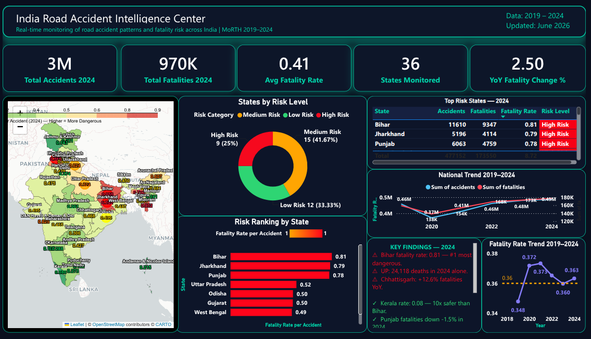
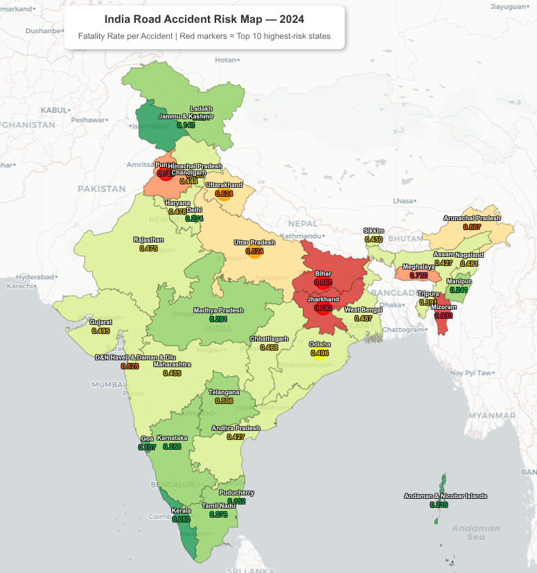
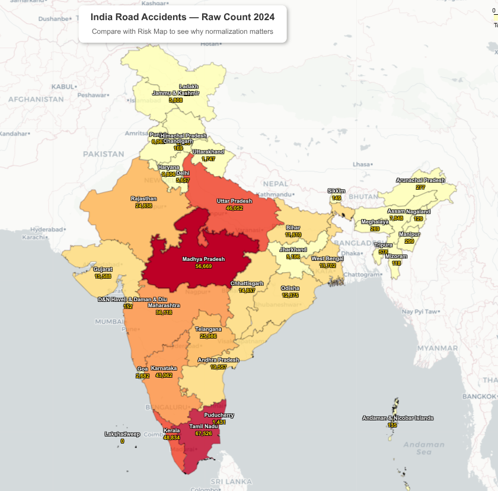
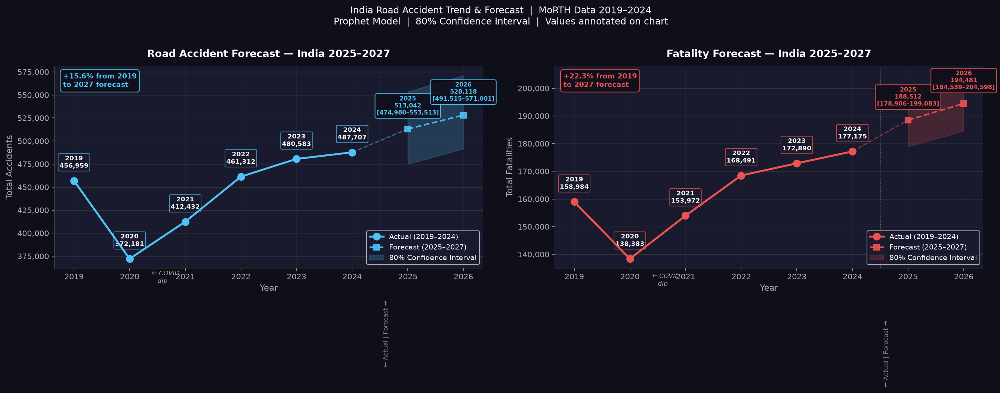
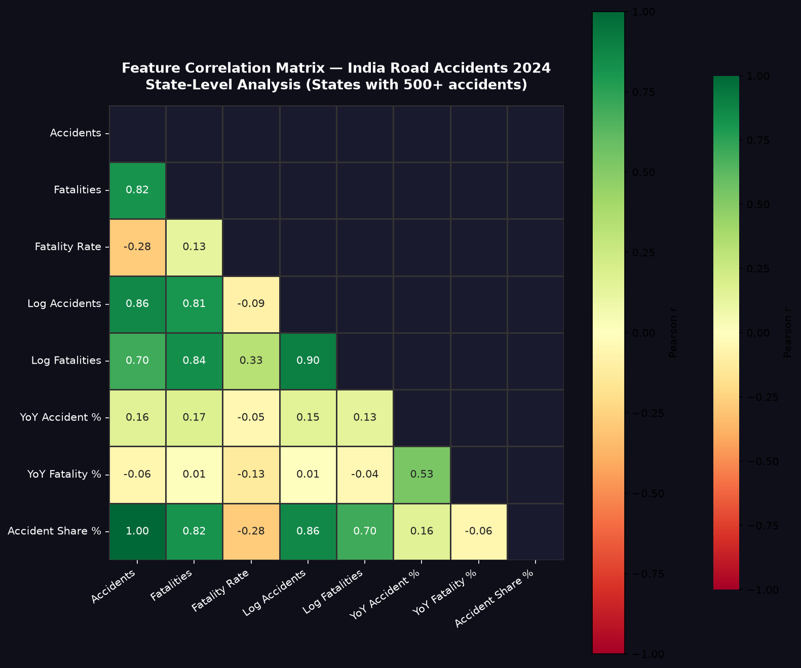
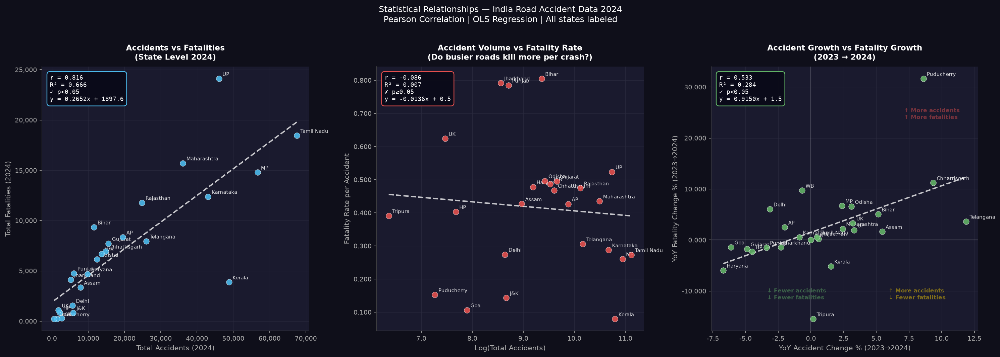

<div align="center">

# 🚨 India Road Accident Pattern Intelligence
### *487,707 accidents. 177,175 deaths. One year. Most analysts just counted them.*
### *This project asked why some states kill 10x more people per crash than others.*

<br>

<table width="100%">
<tr>
<td align="center" width="25%">📅<br><b>6 years</b><br><sub>2019 – 2024</sub></td>
<td align="center" width="25%">🗂️<br><b>15 datasets</b><br><sub>MoRTH · OpenCity · PDF</sub></td>
<td align="center" width="25%">🗄️<br><b>10 SQL tables</b><br><sub>PostgreSQL 16</sub></td>
<td align="center" width="25%">📊<br><b>4 analysis modules</b><br><sub>Maps · Forecast · Stats · BI</sub></td>
</tr>
</table>

<br>

[](outputs/Dashboard.png) [](https://IamShariqMukadam.github.io/India_Road_Accident_Intelligence/outputs/india_risk_map.html)

<br>

> **Data:** MoRTH 2019–2024 · Official Government Reports · No Kaggle
> **Updated:** June 2026 — 2024 data added the month it was released

</div>

---

## 📸 Dashboard & Visuals

### 🧠 Power BI Intelligence Center


### 🗺️ Two Maps. Same Country. Completely Different Stories.

| Fatality Rate *(what actually matters)* | Raw Accident Count *(what everyone shows)* |
|---|---|
| [](https://IamShariqMukadam.github.io/India_Road_Accident_Intelligence/outputs/india_risk_map.html) | [](https://IamShariqMukadam.github.io/India_Road_Accident_Intelligence/outputs/india_accidents_map.html) |

*Click to open full interactive map*

### 📉 Forecast 2025–2027


### 🔥 Correlation Matrix · 📐 Regression Analysis



---

## 🗄️ Data Sources

<div align="center">


</div>

| Dataset | Source | Coverage |
|---|---|---|
| State-wise accidents & fatalities | OpenCity (MoRTH structured) | 36 states, 2019–2023 |
| **2024 state-wise data** | **Manually extracted — MoRTH 2024 PDF Table 5.1 & 5.6** | 36 states, 2024 |
| **Time-of-day accident slabs** | **Manually extracted — MoRTH 2024 PDF Table 7.3** | 8 slabs, 2020–2024 |
| Violation type fatalities | OpenCity (MoRTH structured) | 6 categories, 2023 |
| Road user fatalities | OpenCity (MoRTH structured) | 10 categories, 2023 |
| Large cities accident data | OpenCity (MoRTH structured) | 51 cities, 2023 |

> ⚠️ 2024 data incorporated the **same month** MoRTH publicly released it (June 2026) — most current public analysis available.

---

## ⚡ The Numbers That Matter

> 🚗 **4,87,707 accidents** in 2024 — up +1.5% over 2023
>
> 💀 **1,77,175 fatalities** in 2024 — up +2.5% over 2023
>
> ⚠️ **Bihar is 10x more dangerous per crash than Kerala** — raw counts hide this completely
>
> 🏎️ **68.1% of all road deaths** caused by speeding — drunk driving accounts for just 2.1%
>
> 🕕 **21.1% of accidents happen in 3 hours** (18:00–21:00) — the single deadliest window
>
> 📈 **+31% accident surge since 2020** — fatality rate stuck at 0.36 for 5 consecutive years
>
> 🔮 **India projected to cross 2 lakh fatalities by 2026–27** — Prophet model, 80% confidence

---

## 🔬 What The Data Actually Says

**① Raw accident count is a misleading safety metric**

```
Tamil Nadu  → 67,526 accidents → 18,449 deaths → rate: 0.27
Bihar       → 11,610 accidents →  9,347 deaths → rate: 0.81  ← most dangerous
Kerala      → 48,834 accidents →  3,880 deaths → rate: 0.08  ← safest
```

Bihar kills someone in **8 out of 10 accidents.** Tamil Nadu in 3. Kerala in less than 1. The headline ranking hides this completely.

<br>

**② The time you drive matters more than where you drive**

```
03:00–06:00  ██░░░░░░░░░░░░░░  4.8%   ← safest
18:00–21:00  █████████████████ 21.1%  ← 102,897 accidents
```

Evening commute + low light + fatigue. One 3-hour window. 1 in 5 of all accidents.

<br>

**③ Everyone blames drunk driving. The data doesn't.**

| What kills | Share |
|---|---|
| 🚗 Over-speeding | **68.1%** |
| 🍺 Drunk driving | 2.1% |
| 📱 Mobile phone | 1.7% |

Speeding kills **32x more people** than drunk driving. Awareness campaigns are targeting the wrong problem.

<br>

**④ The Bihar problem is infrastructure, not behaviour**

```
r = -0.086  |  p = 0.68  |  ✗ NOT SIGNIFICANT
```

Busier roads are **not** more deadly per crash. Bihar's crisis is trauma care access and road quality — not driver behaviour.

**Accidents ↔ Fatalities: r = 0.816, p < 0.0001 ✓**

<br>

**⑤ COVID was a pause, not a turning point**

```
2020  ▼ 372,181 accidents    (lockdown dip)
2021  ▲ 412,432
2022  ▲ 461,312
2023  ▲ 480,583
2024  ▲ 487,707              (+31% from 2020)
```

Fatality rate stuck at ~0.36 for 5 years. Road safety spend went up. Outcomes didn't move.

<br>

**⑥ Where it's heading**

*Prophet model · 6 years training data · 80% confidence*

```
2024 →  177,175  (actual)
2025 →  188,512  [178,166 – 198,447]
2026 →  194,481  [184,033 – 204,429]
2027 →  ~200,000  ← crosses 2 lakh
```

---

## 📐 Statistical Layer

*Not just charts — actual hypothesis testing*

| Test | Result | Meaning |
|---|---|---|
| Accidents ↔ Fatalities | r=0.816, p<0.0001 ✓ | Volume drives deaths at state level |
| Log(Accidents) ↔ Fatality Rate | r=-0.086, p=0.68 ✗ | Busy roads ≠ more dangerous per crash |
| YoY Accidents ↔ YoY Fatalities | r=0.533, p=0.006 ✓ | Rising accidents predict rising deaths |
| OLS slope | 0.2652 deaths/accident | Each additional accident → +0.27 fatalities |

---

## 🏗️ Pipeline

```
MoRTH PDFs + OpenCity CSVs
        ↓
   Python cleaning  (15 files · 6 years · 36 states)
        ↓
   PostgreSQL 16  (10 tables · window functions · CTEs)
        ↓
        ├── Folium → 2 interactive India maps
        ├── Prophet → fatality forecast 2025–2027
        ├── scipy + statsmodels → correlation + OLS regression
        └── Power BI → Intelligence Center dashboard
```

```
India_Road_Accident_Intelligence/
├── notebooks/
│   ├── 01_clean_merge.ipynb
│   ├── 02_geospatial_map.ipynb
│   ├── 03_forecasting.ipynb
│   └── 04_correlation_regression.ipynb
├── sql/
│   ├── 01_state_risk_ranking.sql
│   ├── 02_yoy_fatality_trend.sql
│   ├── 03_national_trend.sql
│   ├── 04_time_of_day_peak.sql
│   └── 05_violation_fatality_share.sql
├── data/raw/       ← 15 MoRTH source files
└── outputs/        ← maps, charts, dashboard
```

<details>
<summary>Run it yourself</summary>

```bash
git clone https://github.com/IamShariqMukadam/India_Road_Accident_Intelligence
cd India_Road_Accident_Intelligence
pip install pandas numpy matplotlib seaborn folium geopandas \
            prophet scipy statsmodels sqlalchemy psycopg2-binary

sudo -u postgres psql -c "CREATE DATABASE road_accident_db;"
# Run notebooks 01 → 04 in order
```

</details>

---

## 💡 Who This Is For

**Insurance** — ACKO, Digit, Bajaj Allianz, HDFC Ergo → risk pricing, telematics, UBI products

**Logistics & Rideshare** — Delhivery, Ola, Porter, Rapido → fleet safety, route risk scoring

**Consulting** — Deloitte, EY, McKinsey → government road safety mandates, BFSI clients

---

<div align="center">

**Shariq Mukadam** · Pune · BCA Final Year


*All data from official MoRTH government publications. No Kaggle. No synthetic data.*

⭐ Star if useful

</div>